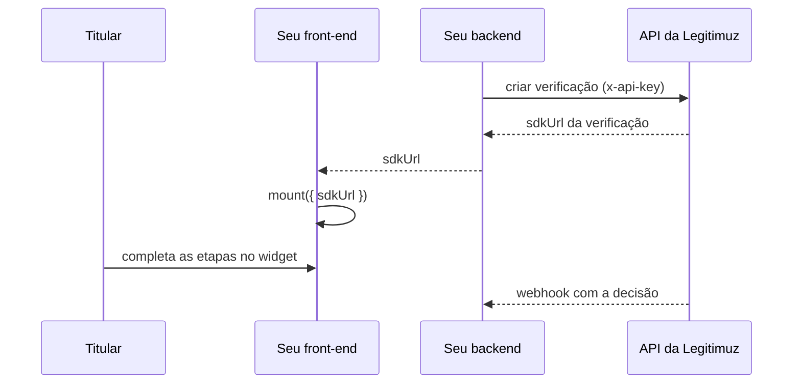

A integração completa tem dois lados. O front-end embute o widget com o
[Web SDK](/web-sdk/visao-geral); o seu backend cria as verificações e recebe as decisões pela API.
O titular e o navegador nunca tocam nas credenciais nem no resultado.

<Info>
  A emissão de verificações pela API está em fase final de implementação. As páginas desta seção
  descrevem o contrato; os pontos ainda em fechamento estão marcados em cada página.
</Info>

## O modelo

1. O seu backend cria a verificação com a chave de API e recebe a `sdkUrl`, uma URL que vale por
   tempo limitado e identifica uma única verificação.
2. O seu front-end monta o widget com essa `sdkUrl`. Nenhuma credencial da integração vai para o
   navegador.
3. O titular completa o fluxo no widget, e o servidor da Legitimuz conduz as etapas.
4. A decisão chega ao seu backend por webhook, nunca ao navegador.

## As credenciais

| Credencial | Quem usa | O que resolve |
| --- | --- | --- |
| Chave de API (`x-api-key`) | O seu backend | A sua conta, a integração e as permissões da chave |
| `sdkUrl` | O widget, via seu front-end | Uma única verificação, com validade curta |

A chave de API nunca sai do seu servidor. A `sdkUrl` é a credencial do fluxo: trate-a como segredo
de curta duração, como descrito em [segurança](/web-sdk/seguranca).

<Columns cols={2}>
  <Card title="Autenticação" icon="key-round" href="/api/autenticacao">
    O formato da chave, o ciclo de vida e a rotação sem downtime.
  </Card>
  <Card title="Criar verificações" icon="user-check" href="/api/verificacoes">
    A porta única de criação, idempotência e a allowlist de origens.
  </Card>
</Columns>
